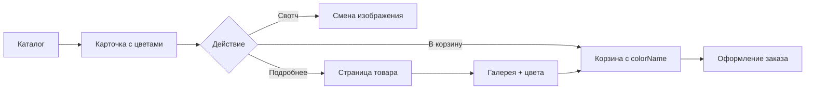

# Phone Market — концепция интернет-магазина iPhone

## Обзор

**Phone Market** — специализированный интернет-магазин смартфонов Apple, построенный по архитектуре [gran-pc](https://github.com/absolutepc/gran-pc). В отличие от PC Market (комплектующие и сборки ПК), здесь единственный бренд — **Apple**, единственная линейка — **iPhone 17**.

## Архитектура (как в gran-pc)

| Слой | Технология |
|------|------------|
| Разметка | Статические HTML-страницы |
| Стили | CSS с переменными (`css/style.css`) |
| Логика | Vanilla JavaScript, без сборщика |
| Данные | `js/data.js` + `localStorage` |
| Шрифты | Inter, JetBrains Mono (Google Fonts) |

## Модель данных товара

Один товар = одна карточка = один SKU (конкретная модель + память + тип SIM). Цвета — **варианты внутри карточки**, не отдельные товары.

```javascript
{
  id: 'ip17-pro-256',
  name: 'Apple iPhone 17 Pro 256 ГБ',
  category: 'iphone-17-pro',
  price: 121990,
  storage: '256 ГБ',
  simType: 'SIM + eSIM',
  series: 'iPhone 17 Pro',
  colors: [
    { name: 'Чёрный титан', hex: '#2b2b2e', img: '...', filter: 'none' },
    { name: 'Белый титан', hex: '#e8e6e1', img: '...', filter: 'brightness(1.2)' },
    // ...
  ],
  specs: { display: '...', chip: 'Apple A19 Pro', ... }
}
```

### Ключевое отличие от gran-pc

В gran-pc цвета видны только на странице товара. В Phone Market **цветовые свотчи встроены прямо в карточку каталога** — пользователь переключает цвет без перехода на детальную страницу. Выбранный цвет сохраняется при добавлении в корзину (`colorName` + `colorHex`).

## Модельный ряд — 15 SKU

### iPhone 17 (базовые)
| ID | Название | Память | SIM | Цена |
|----|----------|--------|-----|------|
| `ip17` | iPhone 17 | 128 ГБ | SIM + eSIM | 89 990 ₽ |
| `ip17-plus` | iPhone 17 Plus | 128 ГБ | SIM + eSIM | 99 990 ₽ |

**Цвета (5):** Чёрный, Белый, Розовый, Бирюзовый, Ультрамарин

### iPhone 17 Pro
| ID | Название | Память | SIM | Цена |
|----|----------|--------|-----|------|
| `ip17-pro-esim-128` | Pro eSIM 128 ГБ | 128 ГБ | eSIM | 109 990 ₽ |
| `ip17-pro-esim-256` | Pro eSIM 256 ГБ | 256 ГБ | eSIM | 119 990 ₽ |
| `ip17-pro-esim-512` | Pro eSIM 512 ГБ | 512 ГБ | eSIM | 139 990 ₽ |
| `ip17-pro-128` | Pro 128 ГБ | 128 ГБ | SIM + eSIM | 111 990 ₽ |
| `ip17-pro-256` | Pro 256 ГБ | 256 ГБ | SIM + eSIM | 121 990 ₽ |
| `ip17-pro-512` | Pro 512 ГБ | 512 ГБ | SIM + eSIM | 141 990 ₽ |

### iPhone 17 Pro Max
| ID | Название | Память | SIM | Цена |
|----|----------|--------|-----|------|
| `ip17-pro-max-esim-256` | Pro Max eSIM 256 ГБ | 256 ГБ | eSIM | 129 990 ₽ |
| `ip17-pro-max-esim-512` | Pro Max eSIM 512 ГБ | 512 ГБ | eSIM | 149 990 ₽ |
| `ip17-pro-max-esim-1tb` | Pro Max eSIM 1 ТБ | 1 ТБ | eSIM | 169 990 ₽ |
| `ip17-pro-max-256` | Pro Max 256 ГБ | 256 ГБ | SIM + eSIM | 131 990 ₽ |
| `ip17-pro-max-512` | Pro Max 512 ГБ | 512 ГБ | SIM + eSIM | 151 990 ₽ |
| `ip17-pro-max-1tb` | Pro Max 1 ТБ | 1 ТБ | SIM + eSIM | 171 990 ₽ |

**Цвета Pro/Pro Max (4):** Чёрный титан, Белый титан, Натуральный титан, Пустынный титан

## Структура страниц

```
index.html      — главная, популярные модели, навигация по сериям
catalog.html    — каталог с фильтрами (модель, память, SIM, цена)
product.html    — детальная страница с галереей и выбором цвета
cart.html       — корзина с отображением выбранного цвета
account.html    — личный кабинет, заказы
search.html     — поиск по каталогу
reviews.html    — отзывы покупателей
about.html      — о магазине
```

## Фильтры каталога

- **Модель:** iPhone 17 / Plus / Pro / Pro Max
- **Память:** 128 / 256 / 512 ГБ, 1 ТБ
- **SIM:** eSIM / SIM + eSIM
- **Цена:** диапазон с ползунком
- **Метка:** Новинка / Хит / Скидка

## Поток покупки



## Корзина

Позиции различаются по `(id, colorName)` — один и тот же iPhone в разных цветах = разные строки корзины (как в gran-pc).

## Запуск

Откройте `index.html` через Live Server (VS Code) или любой статический HTTP-сервер:

```bash
npx serve .
# или
python3 -m http.server 8080
```

Сброс localStorage: `?phonemarket_reset=1`

## Дальнейшее развитие

1. Реальные фотографии iPhone по цветам (`img/phones/...`)
2. Trade-in калькулятор
3. Сравнение моделей
4. Backend + оплата (ЮKassa / СБП)
5. Админ-панель для цен и остатков
